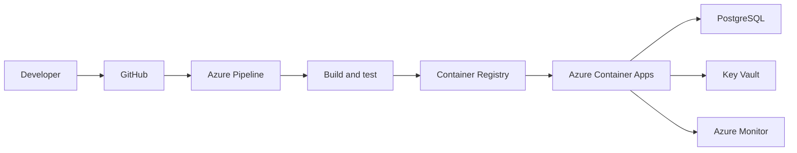

# MKVA Member Management System

A private administrative system for organizing Member Section records, training progress, monthly dues, and payment history. It also demonstrates an Azure-focused DevOps workflow.

## Current prototype

- Member profiles and contact information
- Membership status and training approval workflow
- Monthly dues calculated as 2% of take-home income
- Payment register, CSV export, and JSON backup
- Responsive administrative dashboard

All included records are fictional demonstration data. Never commit real member, salary, banking, payment, or authentication data.

## DevOps roadmap



The current release is a static prototype. Planned work includes an authenticated API, PostgreSQL, automated tests, Bicep infrastructure, Azure deployment, monitoring, and authorized Stripe ACH payments.

## Run locally

Open `src/index.html`, or:

```bash
docker build -t mkva-member-management .
docker run --rm -p 8080:80 mkva-member-management
```

Then visit `http://localhost:8080`.

## Security

Automatic charging is intentionally disabled. Production requires a server-side payment integration, member authorization, secret management, encrypted storage, audit logging, and appropriate legal review.

## License

MIT

